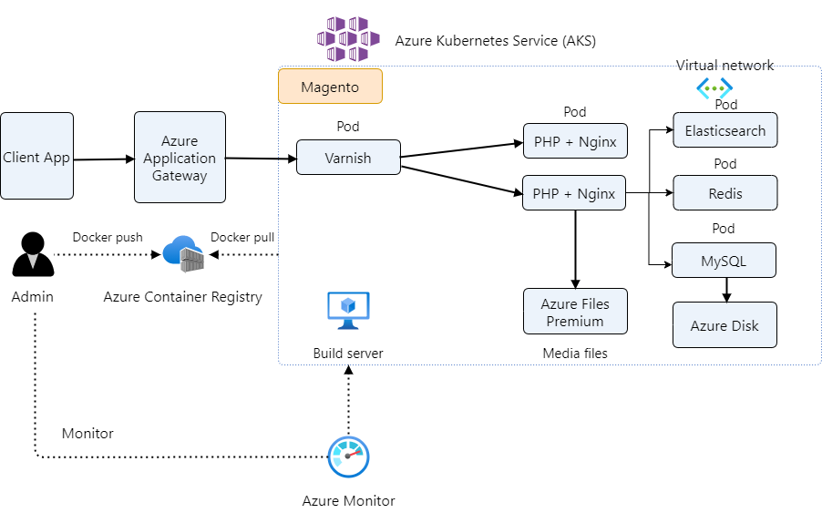

# Magento e-commerce platform in Azure Kubernetes Service

- This article is to host the open-source version of Magento, an e-commerce platform written in PHP on AKS. 
- It's the working version of AKS official example scenario [Magento e-commerce platform in Azure Kubernetes Service](https://learn.microsoft.com/en-us/azure/architecture/example-scenario/magento/magento-azure).
- This setup has been proven in production that handles 6,000 orders a day.

## Architecture



*Download a [Draw.io file](media/magento-architecture.drawio) of this architecture.*

### Components

- [Azure Application Gateway](https://azure.microsoft.com/products/application-gateway) ingress to support secure socket layer (SSL) termination.
- [Azure Kubernetes Service (AKS)](https://azure.microsoft.com/products/kubernetes-service): Scale containers on a managed Kubernetes service.
- [Azure Virtual Network](https://azure.microsoft.com/products/virtual-network): Virtual networks in the cloud.
- [MySQL](https://experienceleague.adobe.com/docs/commerce-operations/installation-guide/prerequisites/database-server/mysql.html?lang=en): MySQL is hosted as a statefulset in AKS. 
- [Azure Files](https://azure.microsoft.com/products/storage/files): File shares in the cloud. This solution uses the Premium tier.
- [Azure Container Registry](https://azure.microsoft.com/products/container-registry): A registry of Docker and Open Container Initiative (OCI) images, with support for all OCI artifacts.


## AKS Env Setup

Steps to setup the AKS environment.

### 1. Login the Azure Cloud Shell or Azure CLI

> Azure Cloud Shell: https://shell.azure.com/bash

> Azure CLI: ```az login```

### 2. Setup Azure Resource Group

> Verify the subscription: ```az account show```

> Switch the subscription if it's needed: ```az account set --subscription subscription_id```

> Set the resource group:  ```export RESOURCE_GROUP=rg-aks-magento```

> Set the cluster name: ```export CLUSTER_NAME=magento```

> Set the location: ```export LOCATION=eastus```

> Set the container registry name: ```export ACR_NAME=acr_magento```

> Set the Application Gateway name: ```export APPGW_NAME=appgw_magento```

> Create resource group: ```az group create --name=$RESOURCE_GROUP --location=$LOCATION```

### 3. Create a basic container registry

```
az acr create --resource-group $RESOURCE_GROUP --name $ACR_NAME --sku Basic --admin-enabled true
az acr update -n $ACR_NAME --admin-enabled true
```

```
ACR_FULLNAME=$ACR_NAME.azurecr.io

# assumes ACR Admin Account is enabled

ACR_UNAME=$(az acr credential show -n $ACR_NAME --query="username" -o tsv)
ACR_PASSWD=$(az acr credential show -n $ACR_NAME --query="passwords[0].value" -o tsv)

kubectl create secret docker-registry acr-secret \
  --docker-server=$ACR_FULLNAME \
  --docker-username=$ACR_UNAME \
  --docker-password=$ACR_PASSWD \
  --docker-email=devops@yourdomain.com

kubectl get secret acr-secret --output=yaml
```

### 4. Create Azure Cluster

Find correct VM size for the cluster components.


```sh
az aks create \
    --resource-group $RESOURCE_GROUP \
    --name $CLUSTER_NAME \
    --node-count 1 \
    --nodepool-name generalpool \
    --generate-ssh-keys \
    --node-vm-size Standard_D4ds_v5 \
    --network-plugin azure \
    --enable-managed-identity -a ingress-appgw --appgw-name $APPGW_NAME --appgw-subnet-cidr "10.225.0.0/16" \
    --enable-cluster-autoscaler \
    --min-count 1 \
    --max-count 2 \
    --node-osdisk-type Ephemeral\
    --zones 1 \
    --enable-ultra-ssd
```

```sh
az aks get-credentials --resource-group $RESOURCE_GROUP --name $CLUSTER_NAME
```

> Add a dedicated system pool

```sh
az aks nodepool add \
    --resource-group $RESOURCE_GROUP \
    --cluster-name $CLUSTER_NAME \
    --name systempool \
    --node-count 1 \
    --node-taints CriticalAddonsOnly=true:NoSchedule \
    --mode System \
    --node-vm-size Standard_D4ds_v5 \
    --enable-cluster-autoscaler \
    --min-count 1 \
    --max-count 2 \
    --node-osdisk-type Ephemeral\
    --zones 1 \
    --enable-ultra-ssd
```

> Changes a system node pool to a user node pool

```sh
az aks nodepool update -g $RESOURCE_GROUP --cluster-name $CLUSTER_NAME -n generalpool --mode user
az aks nodepool update -g $RESOURCE_GROUP -n generalpool --cluster-name $CLUSTER_NAME --node-taints application=general:NoSchedule
```

### 5. Run the `az aks nodepool` add command to add additional node pool of linux operating system.

> Add this for MySQL as it requires lots of RAM

```bash
az aks nodepool add \
    --resource-group $RESOURCE_GROUP \
    --cluster-name $CLUSTER_NAME \
    --name databasepool \
    --node-taints application=mysql:NoSchedule \
    --node-count 1 \
    --node-vm-size Standard_E8bds_v5 \
    --node-osdisk-type Ephemeral \
    --zones 1 \
    --enable-ultra-ssd
```

> Add a node pool for web (nginx/php-fpm)

```bash
az aks nodepool add \
    --resource-group $RESOURCE_GROUP \
    --cluster-name $CLUSTER_NAME \
    --name webpool \
    --node-taints application=web:NoSchedule \
    --node-count 1 \
    --node-vm-size Standard_D4ds_v5 \
    --enable-cluster-autoscaler \
    --min-count 1 \
    --max-count 5 \
    --node-osdisk-type Ephemeral \
    --zones 1 \
    --enable-ultra-ssd
```

> Add a node pool for cron jobs

```bash
az aks nodepool add \
    --resource-group $RESOURCE_GROUP \
    --cluster-name $CLUSTER_NAME \
    --name cronpool \
    --node-taints application=cron:NoSchedule \
    --node-count 1 \
    --node-vm-size Standard_D4ds_v5 \
    --enable-cluster-autoscaler \
    --min-count 1 \
    --max-count 3 \
    --node-osdisk-type Ephemeral \
    --zones 1 \
    --enable-ultra-ssd
```

### 6. Link your Kubernetes cluster with kubectl

```
az aks get-credentials --name $CLUSTER_NAME --resource-group $RESOURCE_GROUP
```

### 7. Run the kubectl get nodes command to check that you can connect to your cluster, and confirm its configuration

```
kubectl get nodes
```


## Prepare Docker Images

Push docker images to the Azure container registery.

### 1. Log in to a registry

```sh
az login
az acr login --name $ACR_NAME
```

### 2. Build the docker image and tag it

```sh
docker tag acr_magento/magento:prod-release acr_magento.azurecr.io/acr_magento/magento:prod-release
```

### 3. Push the image to your registry

```sh
docker push acr_magento.azurecr.io/acr_magento/magento:prod-release
```


## Magento 2 on AKS

Steps to setup the Magento 2 k8s YAMLs. This assumes you have an existing Magento installation. It's migrating to AKS.

### 1. Create namespace

> ```vim magento/01_namespace.yaml```

> YAML: [magento/01_namespace.yaml](./magento/01_namespace.yaml)

> ```kubectl apply -f  magento/01_namespace.yaml```

### 2. Create secrets

```sh
echo -n 'secret' | base64
echo -n 'super_secret' | base64
echo -n '2b502c64c00b5bc7814c0e25855be9df' | base64
echo -n 'secret0' | base64
```

> ```vim magento/02_secret.yaml```

> YAML: [magento/02_secret.yaml](./magento/02_secret.yaml)

SSL cert secrets

```sh
kubectl create secret tls yoursslname --key ../var/ssl/yoursslprivatekey.key --cert ../var/ssl/yoursslcert.crt
kubectl get secret yoursslname -o yaml
```

Update the cert yaml in magento/02_secret.yaml

> ```kubectl apply -f magento/02_secret.yaml```


### 3. Create core-config-data ConfigMap

> ```vim magento/03_configmap_core-config-data.yaml```

> YAML: [magento/03_configmap_core-config-data.yaml](./magento/03_configmap_core-config-data.yaml)

> ```kubectl apply -f magento/03_configmap_core-config-data.yaml```

### 4. Create mysql-config-data ConfigMap

> ```vim magento/04_configmap_mysql-config-data.yaml```

> YAML: [magento/04_configmap_mysql-config-data.yaml](./magento/04_configmap_mysql-config-data.yaml)

> ```kubectl apply -f magento/04_configmap_mysql-config-data.yaml```

### 5. Create varnish-config-data ConfigMap

> ```vim magento/05_configmap_varnish-config-data.yaml```

> YAML: [magento/05_configmap_varnish-config-data.yaml](./magento/05_configmap_varnish-config-data.yaml)

> ```kubectl apply -f magento/05_configmap_varnish-config-data.yaml```

### 6. Create Persistent Volume Claims

> `vim magento/06_pvc.yaml`

> YAML: [magento/06_pvc.yaml](./magento/06_pvc.yaml)

> `kubectl apply -f magento/06_pvc.yaml`

> mysql pvc will only be created when the db pod is starting to create.

### 7. Create MySQL database service and deployment

> ```vim magento/07_mysql.yaml```

> YAML: [magento/07_mysql.yaml](./magento/07_mysql.yaml)

> ```kubectl apply -f magento/07_mysql.yaml```

### 8. Create ElasticSearch service and deployment

> ```vim magento/08_elasticsearch.yaml```

> YAML: [magento/08_elasticsearch.yaml](./magento/08_elasticsearch.yaml)

> ```kubectl apply -f magento/08_elasticsearch.yaml```

### 9. Create Redis service and deployment

> ```vim magento/09_redis.yaml```

> YAML: [magento/09_redis.yaml](./magento/09_redis.yaml)

> ```kubectl apply -f magento/09_redis.yaml```


## DevOps

### 1. Prepare live branches on GitHub

```bash
git clone git@github.com:your_org/your_repo.git aks_magento
cd aks_magento/
git branch
git checkout -b production origin/production
```

## Setup auto deployment

Azure portal > Kubernetes service > aks-magento > Automated deployments (preview) > Create > Deploy an application
Go through the wizard, it will generate a .github/workflow/aks-magento.yml
Update .github/workflow/aks-magento.yml
Add AZURE_LIVE_CLIENT_ID and AZURE_LIVE_TENANT_ID to the GitHub repo Actions secrets and variables
The AZURE_LIVE_CLIENT_ID and AZURE_LIVE_TENANT_ID can be found from Azure portal > App registrations > workflowapp-xxxxxx

### 10. Create Magento Web (php and nginx) deployment

> Make sure to update the `image`

> ```vim magento/10_magento_web.yaml```

> YAML: [magento/10_magento_web.yaml](./magento/10_magento_web.yaml)

> ```kubectl apply -f magento/10_magento_web.yaml```

### 11. Create Varnish service and deployment

> ```vim magento/11_varnis.yaml```

> YAML: [magento/11_varnis.yaml](./magento/11_varnis.yaml)

> ```kubectl apply -f magento/11_varnish.yaml```

### 14. Create ClusterIssuer and Ingress

Create Azure Applicateion Gateway SSL

```bash
az network application-gateway ssl-cert create -g $AKS_NODE_RESOURCE_GROUP --gateway-name $APPGW_NAME -n yourcertname --cert-file '../var/ssl/star_aksmagento_com.pfx' --cert-password 
```

> ```vim magento/12_ingress.yaml```

> YAML: [magento/12_ingress.yaml](./magento/12_ingress.yaml)

> ```kubectl apply -f magento/12_ingress.yaml```

### 12. SSH into the magento-web pod to import the database from your existing Magento installation

```bash
mysql -hdb -umagento -p magento < aks_magento.sql
```

### 15. Deploy upgrade job

> ```vim magento/13_upgrade_job.yaml```

> YAML: [magento/13_upgrade_job.yaml](./magento/13_upgrade_job.yaml)

> ```kubectl apply -f magento/13_upgrade_job.yaml```

### 16. Auto scaling magento-web

> ```vim magento/14_autoscaling_magento_web.yaml```

> YAML: [magento/14_autoscaling_magento_web.yaml](./magento/14_autoscaling_magento_web.yaml)

> ```kubectl apply -f magento/14_autoscaling_magento_web.yaml```